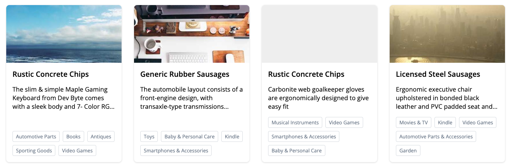

# Products | Coding Kata

Welcome to this little coding kata. Your task is to implement a small set of
features covering HTML & (S)CSS, JavaScript & Typescript as well as Angular &
RxJS. Don't worry, there is no perfect solution. Take five minutes to read
through this README to get you started and know the requirements.

## General setup

This project was generated with [Angular CLI](https://github.com/angular/angular-cli).
Run `ng serve` for a dev server. Navigate to `http://localhost:4200/`. The
application will automatically reload if you change any of the source files.

The project is in a very basic state, only consisting of the `AppComponent` and
the `AppModule`. Additionally, you will find a `ProductService` in `/products`
that you should be using for your implementation. You don't need to change its
implementation though. The `ProductService` exposes a single method `get()`,
which returns an [RxJS](https://rxjs.dev/) Observable holding a paginated list
of product entities.

## Your task
Your task is threefold and involves different areas of our frontend development.

### HTML & CSS
Implement a card-based layout for the product view. This is not about building
a pixel-perfect replica of the design we are handing out, but more about getting
the overall design right. Here are a few requirements / guidelines that you
should consider while building your solution:

* The card displays all contents of a product:
  - The product **image** in a 2:1 ratio on the top or a placeholder if it is
  not available.
  - The full product **title**.
  - The product **description**, with a max. of three lines and an ellipsis if
  it is longer.
  - The inline list of product **categories**. Categories are always displayed
  on the bottom of the card.
* When clicking a card, the product **URL** is opened in a new tab.
* Cards are aligned on a responsive layout with cards filling the available
space while always maintaining a minimum width of `16rem`.

Below you can find a screenshot and animation of the final result.

### RxJS

As of now, the current solution only displays the first page of products. A
"Read More" button is already in place though. Utilize the power of RxJS to
implement this button and load the next page (and append it to the content)
whenever the user clicks it. Give the user feedback while loading data and
handle errors gracefully.

### Angular

There is no specific Angular task, but we do expect you structure your
implementation into Angular modules / components / services how you see fit.

## Submitting your solution

You can simply provide your solution by creating a pull request for this
repository.
